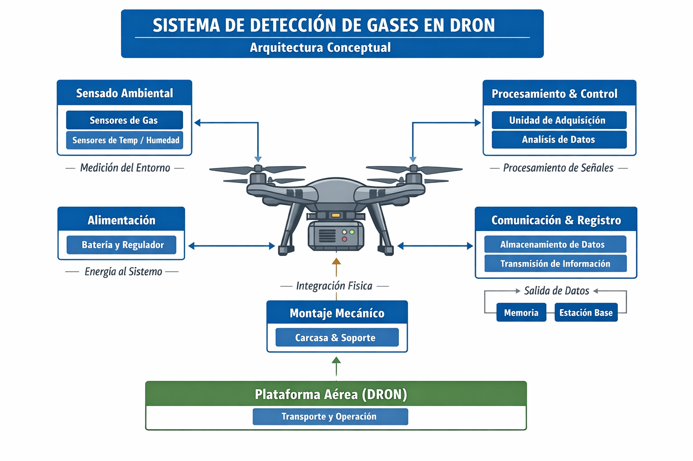
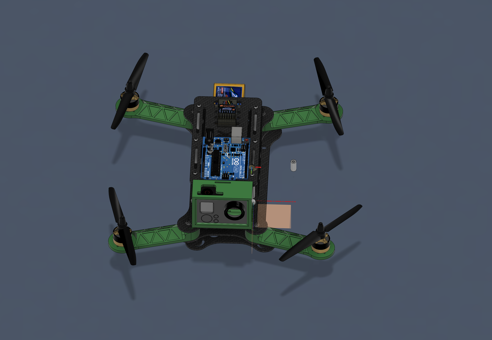
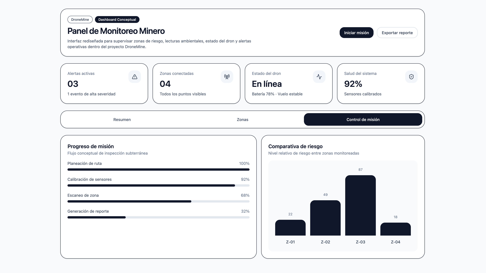

# 🚁 DroneMine

### Conceptual Drone-Based Monitoring System for Mining Environments

---

## 🧠 Project Summary

**DroneMine** is a conceptual engineering project focused on designing a **drone-assisted monitoring system** to improve safety and operational efficiency in mining environments.

The project explores how autonomous or remotely operated drones, equipped with environmental sensors, can be used to **inspect hazardous areas, detect toxic gases, and provide actionable insights through a digital platform**.

> ⚠️ This project is a **conceptual system design**, not a fully implemented solution.

---

## 🚨 Problem

Mining operations expose workers to high-risk conditions, including:

* Toxic gas exposure (CO, CO₂, CH₄, etc.)
* Structural instability (collapses, confined spaces)
* Limited accessibility to dangerous zones
* High inspection and operational costs

Current inspection methods often require **direct human involvement in unsafe environments**.

---

## 💡 Solution Concept

# 🚀 Live Demo

A conceptual dashboard prototype was developed to simulate how the DroneMine system could operate in a real-world scenario.

👉 **[https://dronemine-dashboard.vercel.app](https://dronemine-dashboard.vercel.app)**

> ⚠️ This dashboard is a **UI prototype only** and is not connected to real drone hardware or live sensor data.

---

## 🧠 About the Project

DroneMine proposes a **modular monitoring system** that combines:

* 🚁 A drone platform for remote inspection
* 🌫️ Environmental sensors for gas detection
* 📊 A digital dashboard for data visualization

### Intended Capabilities

* Remote inspection of hazardous areas
* Real-time environmental data acquisition *(conceptual)*
* Detection of dangerous gas concentrations
* Centralized monitoring via web dashboard

---

## 🧩 System Design (High-Level Architecture)

```
[ Drone + Sensors ]
        ↓
[ Embedded System (Raspberry Pi) ]
        ↓
[ Data Transmission (Conceptual) ]
        ↓
[ Web Dashboard Interface ]
```

### Components

#### 🚁 Drone Layer

* Custom drone design (Fusion 360)
* Sensor integration (gas detection)
* Visual inspection via camera

#### 🧠 Embedded Layer

* Raspberry Pi (conceptual use)
* Sensor data acquisition

#### 📡 Communication Layer *(Not Implemented)*

* Intended wireless transmission in constrained environments

#### 💻 Software Layer

* Web-based dashboard (UI prototype)
* Planned features:

  * Data visualization
  * Monitoring interface
  * Alert system

---

## 🛠️ Tools & Technologies

### Engineering & Design

* Fusion 360 (3D modeling)
* System & electronics diagrams
=======
* 🚁 **Drone platform** for remote inspection
* 🌫️ **Environmental sensors** for gas detection
* 📊 **Web dashboard** for monitoring and decision-making

---

## 🧩 System Architecture



The system was designed with multiple layers:

* **Sensing Layer** → Gas, temperature, environmental data
* **Processing Layer** → Data acquisition and analysis
* **Communication Layer** → Data transmission *(conceptual)*
* **Monitoring Layer** → Dashboard interface

---

## 🚁 Drone Design



Designed in **Fusion 360**, including:

* Structural frame design
* Sensor mounting system
* FPV camera integration
* Internal component distribution

---

## 📊 Dashboard Concept



A conceptual dashboard designed to:

* Visualize environmental data
* Monitor zones and alerts
* Track mission progress

👉 **Try the interactive version:**
[https://dronemine-dashboard.vercel.app](https://dronemine-dashboard.vercel.app)

---

## 🛠️ Technology Stack

### Hardware (Conceptual)

* Raspberry Pi
* Gas sensors (MQ series)
* Drone components

### Software (Planned)

* Python (data processing)
* PHP (backend)
* HTML/CSS (frontend)

### Methodology

* Kanban (project organization)

### Design & Engineering

* Fusion 360
* System architecture diagrams

### Prototype (UI Demo)

* React
* Tailwind CSS
* Recharts
* Framer Motion

---

## 📦 Project Artifacts

This repository includes:

* 📄 Technical proposal
* 📊 Business model canvas
* 🎨 Drone design renders
* 🧩 System diagrams
* 🖥️ Dashboard mockups

---

## 🧪 Incubation & Recognition

DroneMine was developed and evaluated in:

* 🧪 **Talentic (Pre-incubation program)**
* 🏢 **Gimnasio Avanzza (Business Incubator)**
🏅 Recognized as part of innovation and entrepreneurship initiatives.


---

## 📊 Project Status

| Component               | Status            |
| ----------------------- | ----------------- |
| Drone 3D Design         | ✅ Completed       |
| System Architecture     | ✅ Defined         |
| Dashboard UI            | ⚠️ Prototype      |
| Hardware Implementation | ❌ Not developed   |
| Data Integration        | ❌ Not implemented |
| Functional MVP          | ❌ Not built       |

| Component    | Status            |
| ------------ | ----------------- |
| Drone Design | ✅ Completed       |
| Architecture | ✅ Defined         |
| Dashboard    | ⚠️ UI Prototype   |
| Hardware     | ❌ Not built       |
| Integration  | ❌ Not implemented |

---

## 👨‍💻 My Role

I contributed as a **System Designer and Technical Developer**, focusing on:

* 🧠 **System Architecture Design**

  * Defined the overall structure of the system (hardware + software)
  * Designed sensor integration at a conceptual level

* 🎨 **3D Modeling**

  * Created a drone model using Fusion 360
  * Designed component layout and structure

* 📄 **Technical Documentation**

  * Wrote complete project documentation
  * Defined problem, solution, scope, and feasibility

* 📊 **Business Model Development**

  * Built a Business Model Canvas
  * Identified value proposition, market, and revenue streams

* 📋 **Project Management**

  * Organized development using Kanban methodology

---

## 📈 Key Skills Demonstrated

* Systems thinking (hardware + software integration)
* Conceptual product design
* Technical documentation
* Engineering problem analysis
* Early-stage solution modeling

---

## ⚠️ Limitations

* No hardware prototype was built
* No real data acquisition or transmission implemented
* Dashboard remained at UI/mockup level
* Environmental and operational constraints were not fully validated

---

## 🧠 Key Learnings

This project helped me understand:

* The complexity of real-world engineering systems
* The importance of **incremental development (MVP approach)**
* The gap between conceptual design and implementation
* Challenges in communication and navigation in constrained environments
* Systems thinking (hardware + software)
* Product-oriented design
* Technical documentation
* Real-world engineering constraints

---

## 🚀 Future Improvements

* Develop a functional IoT-based gas monitoring system
* Build a real dashboard with simulated or live data
* Integrate with commercial drone platforms (e.g., DJI SDK)
* Implement alert systems and anomaly detection

---

## 📍 Context

* 🎓 Developed during university (2023)
* 🏫 Universidad Tecnológica del Suroeste de Guanajuato
* 🧪 Pre-incubation program for tech-based projects

---

## 📝 Final Note

DroneMine represents a **conceptual exploration of a complex engineering system**, demonstrating my ability to:

* Break down real-world problems
* Design structured technical solutions
* Document and communicate ideas effectively

---
